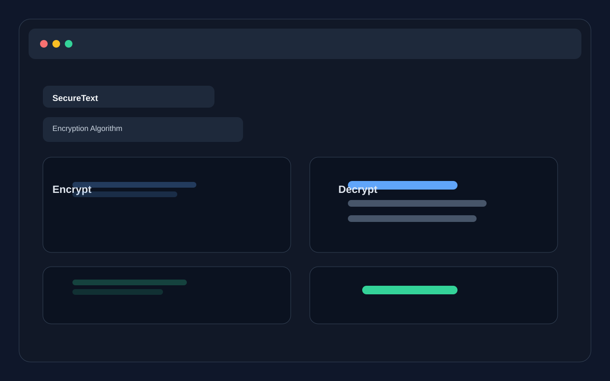

# SecureText

A modern browser-based encryption and decryption toolkit built with HTML, CSS, and JavaScript.

SecureText lets you encrypt and decrypt text using multiple algorithms directly in the browser, without sending your data to a server. It is designed for quick experimentation, learning, and lightweight privacy-friendly text processing.

## Live Preview

GitHub Pages preview URL:
https://uzair686.github.io/encryption-app/

> Enable GitHub Pages in the repository settings to make the site live publicly.

## Features

- AES-256 encryption with password-based key support
- Caesar cipher support with custom shift value
- Base64 encoding and decoding
- ROT13 transformation
- Reverse text transformation
- XOR cipher support
- Dark mode toggle for comfortable use
- Copy and download output actions
- Client-side processing for privacy-focused usage

## Screenshot



## Getting Started

### Option 1: Open directly

Open `index.html` in your browser.

### Option 2: Run a local server

```bash
python -m http.server 8000
```

Then open:

```text
http://localhost:8000
```

## Project Structure

```text
encryption-app/
├── index.html
├── styles.css
├── script.js
├── test.js
├── lib/
│   └── crypto-js.min.js
├── assets/
│   └── screenshot.svg
├── README.md
├── LICENSE
├── .gitignore
└── package.json
```

## Usage

1. Choose an encryption algorithm.
2. Enter the text you want to encrypt or decrypt.
3. Provide a password or shift value when required.
4. Click the appropriate action button.
5. Copy or download the generated result.

## Security Note

This application performs all encryption and decryption locally in the browser. Sensitive text stays on your machine unless you intentionally share the output.

## License

This project is licensed under the MIT License. See the [LICENSE](LICENSE) file for details.

## Author

Uzair686
